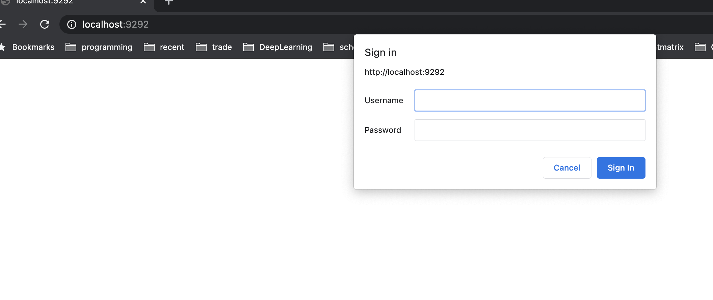
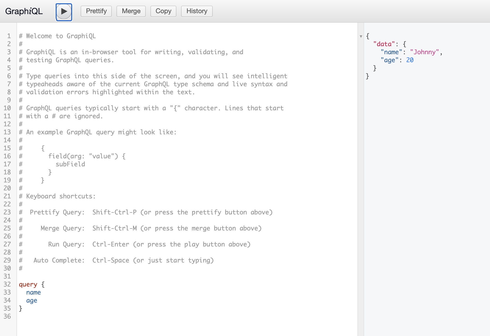

# Microservice Contract Testing

- [Microservice Contract Testing](#microservice-contract-testing)
  - [Quick Start](#quick-start)
    - [Start Pact Broker](#start-pact-broker)
    - [Install packages for providers](#install-packages-for-providers)
    - [Install packages for consumers](#install-packages-for-consumers)
  - [Command](#command)
    - [Provider commands](#provider-commands)
    - [Consumer commands](#consumer-commands)

## Quick Start

### Start Pact Broker

```
docker-compose up
```

It will start a broker server and a postgres server.
You shall be able to visit the broker via [http://localhost:9292](http://localhost:9292) but just see an example contract.
Note you need to type the username and password which can be found in `docker-compose.yml` file.



### Install packages for providers

1. user-service (http://localhost:4100/graphql)

```bash
cd user-service
yarn install
yarn start
```

2. company-service (http://localhost:4101/graphql)

```bash
cd company-service
yarn install
yarn start
```

You shall be able to visit the graphql playground like below:


### Install packages for consumers

```bash
cd consumer
yarn install
```

## Command

### Provider commands

| <div style="width:300px">cmd</div> | description                                                                                                    |
| ---------------------------------- | -------------------------------------------------------------------------------------------------------------- |
| `yarn test`                        | Run unittest with the latest contract from broker locally                                                      |
| `yarn contract:verify`             | Verify if current changes will affect consumers' contracts that depends on this service (should do this in CI) |
| `yarn contract:can-i-deploy`       | Check if current changes can be deployed using the latest contract from broker                                 |

### Consumer commands

| <div style="width:300px">cmd</div> | description                                                                             |
| ---------------------------------- | --------------------------------------------------------------------------------------- |
| `yarn test`                        | Run unittest and generate contract locally                                              |
| `yarn contract:publish`            | Publish the generated contract to broker (should only do it in CI)                      |
| `yarn contract:can-i-deploy`       | Check if current consumer changes can be deployed using the latest contract from broker |
